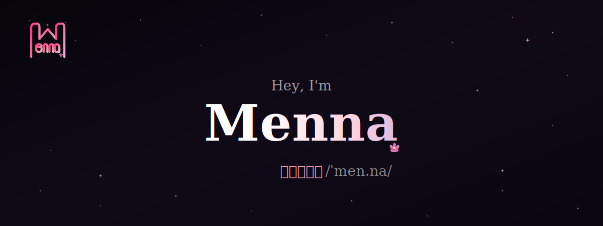

  

  
  
  
  

---

  <em>Software engineer building in crypto and DeFi, DEI advocate, occasional writer on tech and life.</em>

---

### 🌸 About Me

Software engineer working on blockchain infrastructure and DeFi. I write smart contracts, build indexers, and occasionally write about it.

[Full background on my website →](https://www.mennatnaga.xyz/about)

### 🌸 What I Work With

  
  
  
  
  

  
  
  
  
  

### 🌸 What I Do

- **Blockchain & DeFi**: Smart contracts, lending protocols, indexers
- **Software Engineering**: Full-stack dev, system design, code reviews
- **Writing**: Technical tutorials and thoughts on DeFi

### 🌸 Latest Blog Posts

<!-- BLOG-POST-LIST:START -->
- [Technical Deep Dive: What Are Blockchain Indexers? How To Build One with Envio](https://mennatnaga.xyz/blog/blockchain-indexers-how-to-build-an-envio-indexer)
<!-- BLOG-POST-LIST:END -->

  

### 🌸 Organizations

  
  

---

  

